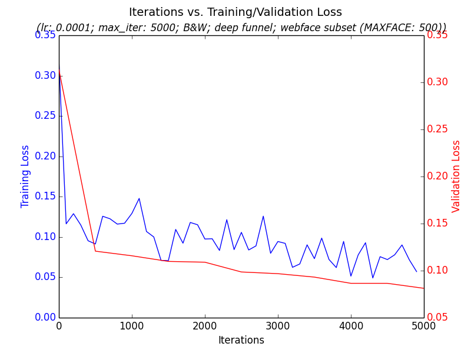
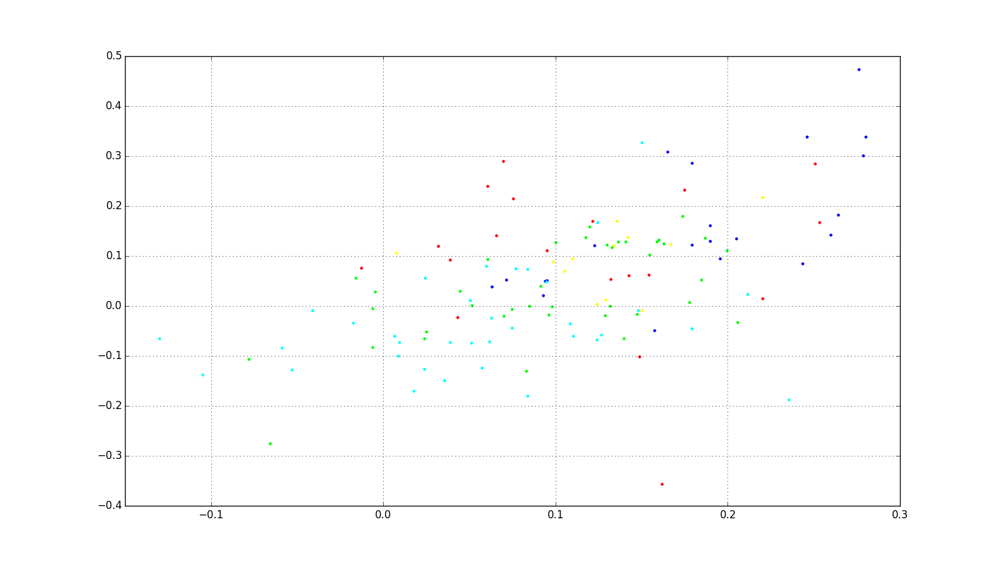
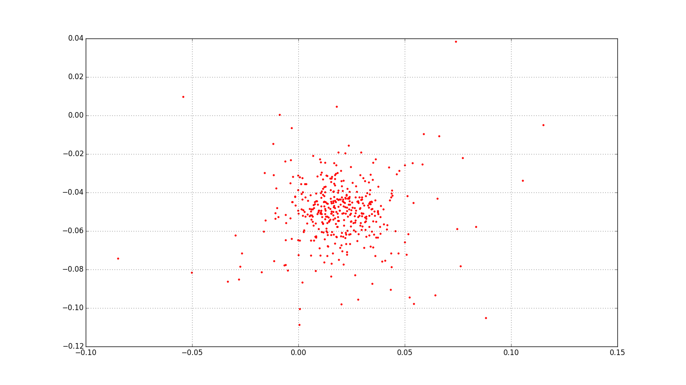

# Introduction

This repo was a personal learning experiment. The attempt was to allow someone to train a neural network over their personal photo collection in order to do face detection on the people in those photos. They could then organize the photos by those people into automatic groups.

This problem was characterized by small labeled training sets, as we only want to ask the user to identify a few of the users to train the net. An individual trained photo model would also be kept private and not shared between photo users for privacy reasons, which can make training more challenging.

The goal was to ground the theoretical education I got in [Geoffrey Hinton's Neural Network Coursera course](https://www.coursera.org/course/neuralnets) in an actual, hard programming project.

# Results & History

My goal was to take a standard publicly available dataset, such as [Labelled Faces in the Wild (LFW)](http://vis-www.cs.umass.edu/lfw/), and train a neural network on it. Then, I would apply transfer learning on the trained model, applying some smaller labelled set of faces from a user's personal photo collection.

I started by using a [siamese network architecture](http://yann.lecun.com/exdb/publis/pdf/chopra-05.pdf). A siamese network takes two images and whether they represent the same thing or not (such as two people) and learns a function that will cluster similar images near each other and dissimilar ones far away. In essence it learns an embedding that can cluster faces of the same person near each other.

My hypothesis was that this would generalize better than a standard softmax classifier. Imagine I had trained a softmax classifier with discrete outputs for each face identity on the LFW dataset ("John", "Jane", etc.); I felt that if I then tried to do transfer learning on this model to a user's own personal photos collection that it would not do well, as the softmax classifier would not know people outside the LFW dataset. In contrast, I hypothesized that a siamese network's learned discriminative function would generalize better beyond the dataset it was trained on to a user's personal photos collection.

Note that siamese networks do facial validation, not classification. This means they will tell you if two faces are the same or not, but they won't tell you that a given face is "Bill Gates" or "Steve Jobs". For the UI that might be attached to this trained model, I hypothesized that the model could simply cluster similar faces in a user's photo collection next to each into "stacks" using facial validation -- the user could then add labels to these clusters, such as "Mom", "Dad", etc. A given face with a given optional user-provided label could then be the 'centroid' we could use to provide classification using the trained siamese network facial validation model.

I also decided to start with gray scale images only rather than full RGB images. This was for two reasons: 1) when I found an optimal architecture generalizing to RGB wouldn't be that hard, and 2) training and setup time would be much faster as I would be dealing with much less data (grayscale vs. color).

With these decisions in place, I moved to setup Caffe and created a pipeline that I could run experiments on. I started with a collection of bash scripts but quickly moved to a unified Python based pipeline that was easier to maintain, extend, and to run quick experiments on as I tried different architectures and hyperparameter settings. The pipeline generated graphs such as iterations vs. loss on training/validation sets:

A trained siamese network learns a function that clusters similar faces near each other. However, once you've learned this, you still have to pick a hyperparameter 'margin' at which to threshold whether two faces are the same or not based on their distance metric. I therefore decided to break the problem into two parts: try to get a siamese network that clusters similar faces near each other, and once I had that _then_ try to do hyperparameter tuning to get a good margin that resulted in acceptable accuracy, recall, precision, etc.

To evaluate how well the training was happening on the siamese clustering function independent of the hyperparameter margin, I tracked both the loss falling over time on both the training and validation data sets as well as simply graphing the clusters resulting from a trained model on a subset of faces.

For a long time, I essentially ended up with validation cluster graphs that looked like this, which is not good; this represents about five people, with each person getting a unique color. The location of each dot is the x/y value emitted by the trained siamese network similarity function:

If you look in [src/siamese_network_bw/logs/](src/siamese_network_bw/logs/) you'll see many, many experiments while I was trying to work through this.

There were several solutions to getting better clustering.

First, it turns out there were subtle bugs in how I was preparing my data for Caffe that lead to bad training. I devolved my network from faces to using MNIST hand-labelled numbers and got good results on that; this helped to flush out several subtle bugs in my code that were related to improperly preparing my data for Caffe.

Second, it turned out that the LFW dataset I was using is very imbalanced: a few people have a huge number of representative images, while most people have very few. This was skewing the training as there weren't enough positive and negative examples for most people to work with. I ended up getting access to the [CASIA WebFace dataset](http://arxiv.org/pdf/1411.7923.pdf) which has about 500,000 face images as opposed to LFW's ~13,000 images. I subsetted this to about the same size as LFW (13K faces divided 80% training and 20% validation).

Third, the LFW images I was using did not have 'face alignment', which meant that some key point in the faces were always in the same place. I ended up using deep aligned images from the CASIA WebFace dataset, which means that the eyes for all people were always in the same location in the image. While my network could probably have eventually discerned and learned this pattern itself, providing facial alignment in the input data probably helps to reduce the amount of data needed and training time by a significant factor, possibly orders of magnitude.

Finally, and most importantly, how I generated my positive and negative pairings for training turned out to be _very_ important. I only started getting good clustering once I generated all possible positive and negative pairings amongst my training set. The [original siamese network paper](http://yann.lecun.com/exdb/publis/pdf/chopra-05.pdf) actually generated all possible pairings to get their results.

However, generating all possible pairings can explode your data size very fast. I started with a much smaller set of faces and generated all possible positive and negative pairings of these. I ended up with stronger clustering; here are the images for a single person clustering:

Going on the hypothesis that generating all possible positive and negative pairings seemed like a good pathway forward, I decided to take a subset of the CASIA WebFace data and do this. There seemed to be two possibilities:

1) Pre-generate all possible positive and negative pairings and train from them.

2) Figure out statistically probable positive and negative pairings as if you had hard generated them at data prep time and feed them into Caffe at runtime using a [memory data layer](http://caffe.berkeleyvision.org/tutorial/layers.html#in-memory).

While #2 is much more desirable from a resources stand point, it also seemed quite tricky to figure out the best statistical sampling approach as well as code up the C++ Caffe memory data layer. I decided to start with #1 on a subset of my images to see how the approach scaled before getting fancy with #2.

Generating all possible positive and negative pairings gets expensive fast due to combinatorial explosion. Up till now I had been training on my laptop which has a GPU and an SSD, but as soon as I wanted to generate all positive and negative pairings for a subset of faces I was looking at about 1.5 TBs of data. This was much too large for my SSD; it also caused my relatively naive data preparation pipeline to fall over.

I rewrote my data pipeline to prepare its image pairing data in LevelDB in a way that memory use was constant (pairings would be prepared and written to disk in batches). Data prep performance was still much too slow; profiling revealed that both protobuf serialization and the default Python LevelDB library were both slow. I swapped out my LevelDB library for [Plyvel](https://plyvel.readthedocs.org/en/latest/) and also switched to a more efficient [C++ implementation of Protobuf](http://yz.mit.edu/wp/fast-native-c-protocol-buffers-from-python/) that still had Python bindings. Both of these helped speed up the data prep time. Since my SSD was only 225 GBs, I also switched to writing my 1.5 TB data to an external hard drive.

I let all of these train with a larger number of pairings then before; surprisingly, the network did not do well at clustering even though this approach had done well earlier with a smaller number of images. It seemed that clustering would happen for smaller sets of all pairings but would wildly diverge when I increased the data size. At this point I was only training on about 8000 images from the full CASIA-WebFace data set of 500,000 images so it was disappointing that the siamese network fell over when using all possible positive/negative pairings from this smaller data set; it did well on a much smaller number of images but didn't get better with more data.

At this point I decided that siamese networks didn't seem to be worth their complexity -- they didn't seem capable of easily getting better results by absorbing more data, whereas a simple softmax classifier like AlexNet used on the ImageNet competition seemed capable of getting better as it used more data without the added complexity introduced by siamese networks.

At this point I decided to put a stop to the project -- it was a great learning experience and helped ground much of the theory I had learned in Geoffrey Hinton's Coursera course into actual work on a hard problem that didn't have easy answers.

If I were to continue with the project, I would take one of two paths:
* Train on a standard deep network with a softmax classifier, such as AlexNet or Inception. I would then 'chop off' the softmax classifier and use the final layer as an embedding that I could do comparisons on, such as the L2 distance between two embedded representations of two faces, to see if two faces are from the same person against new faces that weren't trained against.
* I might explore a more sophisticated embedding similar to the siamese network model but more nuanced, such as [Google's FaceNet](http://arxiv.org/abs/1503.03832).

# Using this Code

Feel free to use this code for your own project! It's available under an Apache 2 license. Note, though, that this code has been cleaned up and significantly extended for platforms like running on EC2 over in the [cloudless open source project](https://github.com/BradNeuberg/cloudless) I'm part of, so you probably want to grab that code instead.

# Setup

* [Python Anaconda](http://continuum.io/downloads) is recommended as the Python you use.

* Make sure you've compiled Caffe with the Python bindings on.
    make pycaffe
    make distribute

* Add a CAFFEHOME environment variable to where you installed Caffe. Example:
    export CAFFEHOME=/usr/local/caffe

* Make sure you've gone into $CAFFEHOME/python and pip installed the requirements.txt file there:
    cd $CAFFEHOME/python && sudo pip install -r requirements.txt

* Add the following directories to your Python path (update the personal-photos-model path
to where you actually installed it):
    export PYTHONPATH=$PYTHONPATH:~/dev/personal-photos-model/lib:~/dev/personal-photos-model/src:$CAFFEHOME/python:$CAFFEHOME/distribute/python

* Make sure your DYLD_FALLBACK_LIBRARY_PATH is correct, something like the following:
    export DYLD_FALLBACK_LIBRARY_PATH=/usr/local/cuda/lib:/Users/bradneuberg/anaconda/lib:/usr/local/lib:/usr/lib:.

* Install [LevelDB](http://stackoverflow.com/questions/26199376/how-to-install-leveldb-on-mac-os-x) and [plyvel](https://plyvel.readthedocs.org/en/latest/):

* Make sure Google Protobufs is installed:
    sudo pip -g install protobuf

* (Optional) Make sure Google Protobufs has been compiled to use the Python wrappers with a C++ backend; things will work without it but it will slightly speed up data prep time:
    export PROTOCOL_BUFFERS_PYTHON_IMPLEMENTATION=cpp
    export PROTOCOL_BUFFERS_PYTHON_IMPLEMENTATION_VERSION=2

# Running Pipeline

The main tool to prepare data, train, and evaluate the results is 'prepare_data.py'. Run it on the command line to get help on options:

    ./src/siamese_network_bw/facial_recognition.py --help
